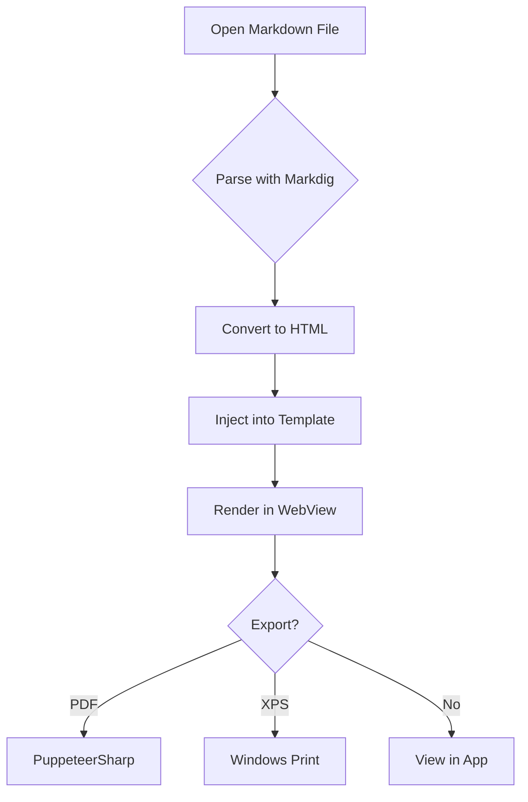
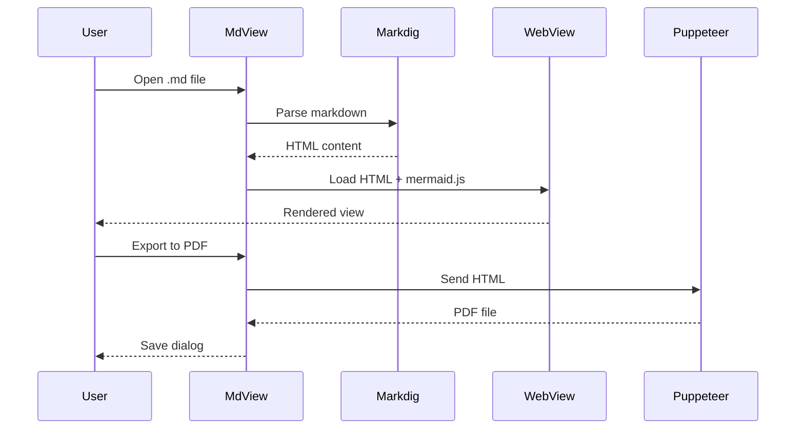

# MdView Demo

Welcome to **MdView** — a cross-platform Markdown viewer with Mermaid diagram support.

## Features

- Markdown rendering with GitHub-flavored styling
- Mermaid diagram support
- PDF and XPS export
- Live file watching (auto-reload on save)
- Drag-and-drop file opening
- Dark mode toggle
- Platform-native styling (macOS / Windows)

## Code Example

```csharp
public class HelloWorld
{
    public static void Main(string[] args)
    {
        Console.WriteLine("Hello, MdView!");
    }
}
```

## Table Example

| Feature | macOS | Windows |
|---------|-------|---------|
| Native menu bar | Yes | No (in-window) |
| Title bar style | Extended | Standard |
| Theme | macOS HIG | Fluent |
| XPS Export | No | Yes |

## Mermaid Flowchart



## Mermaid Sequence Diagram



## Blockquote

> "The best way to predict the future is to invent it."
> — Alan Kay

## Task List

- [x] Markdown rendering
- [x] Mermaid diagrams
- [x] PDF export
- [x] XPS export (Windows)
- [x] Dark mode
- [x] File watching
- [x] Drag and drop

---

*Built with Avalonia UI, .NET 10, and Markdig*
